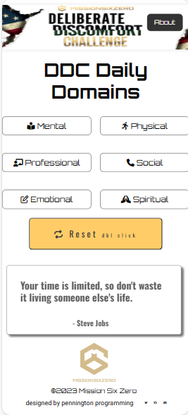

# ddc-domaintracker
deliberate discomfort 6 domain tracker, resets every day.

 ## repository
 https://github.com/egpennington/ddc-domaintracker

 ## live site
 https://ddc-domaintracker.netlify.app/

## Table of contents
- [Overview](#overview)
  - [The challenge](#the-challenge)
  - [Screenshot](#screenshot)
  - [Links](#links)
- [My process](#my-process)
  - [Built with](#built-with)
  - [What I learned](#what-i-learned)
  - [Continued development](#continued-development)
  - [Useful resources](#useful-resources)
- [Author](#author)
- [Acknowledgments](#acknowledgments)

## Overview

### The challenge

Users should be able to:
- user can check off each domain as completed
- domains resets everyday automatically
- reset button allows user to reset manually
- random motivational quote every day
- stretch goals:
  - add a countdown clock for the day
  - add animation or a sound for each domain checked off

### Screenshot





### Links
- Live Site URL: (https://ddc-domaintracker.netlify.app/)

## My process

### Built with
- Semantic HTML5 markup
- CSS custom properties
- Flexbox
- Grid
- JavaScript

### What I learned

Recap over some of learnings while working through this project.

First, i would like to have a better  UI/UX design

Looked up way to use localStorage to use a 24 hour reset on the marked off buttons

```js
    const getCurrentDate = () => {
      const now = new Date()
      const year = now.getFullYear()
      const month = String(now.getMonth() + 1).padStart(2, "0")
      const day = String(now.getDate()).padStart(2, "0")
      return `${year}-${month}-${day}`
    }
```

### Continued development

Add more functionality, like a clock countdown for the day

### Useful resources

- MDN and ChatGPT were very helpful, especially setting up the 24 hour reset.

## Author
- Website - [Emmett Pennington](https://www.COMINGSOON)
- discord - [emmettpenn23(애멧)]
- Frontend Mentor - [@egpennington](https://www.frontendmentor.io/profile/egpennington)
- Twitter - [@yemmettpenn23](https://www.twitter.com/emmettpenn23)
- email - [egpennington@hotmail.com]

## Acknowledgments
scrimba.com bootcamp and Brad Traversy have helped in my programming development
